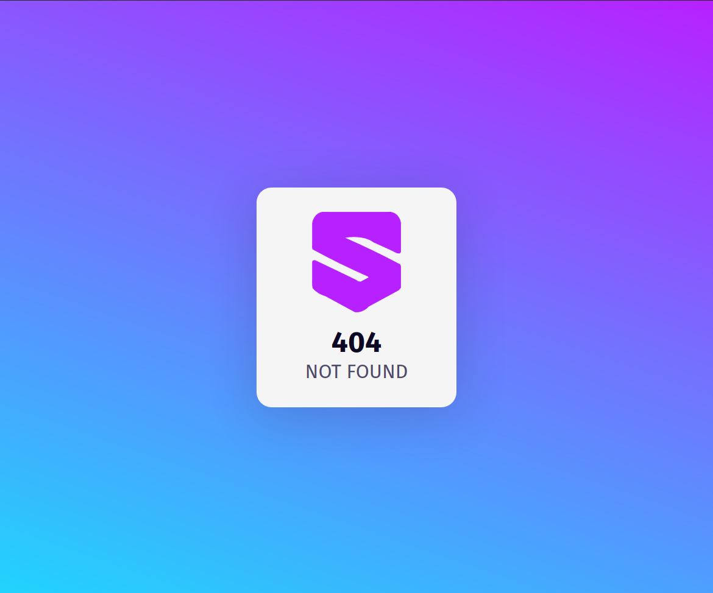

# shortr
Simple, but blazingly fast, url shortener in various languages and frameworks


_**Note:** this is just a simple service to learn various languages and frameworks. Efficiency nor security or mantainabilty are intended in this project._

## Languages
- **Golang**
    - [Echo](go/echo/README.md)
- **JavaScript**
    - [Express](js/express/README.md)
- **TypeScript**
    - [Deno](js/deno/README.md)
- **Python**
    - [FastApi](py/fastapi/README.md)
- **Rust**
    - [Actix-Web](rs/actix/README.md)

## Screenshots




## Setup
- Install:
    - [`docker 19.03.6 >=`](https://docs.docker.com/get-docker/)
    - [`docker-compose 1.21.0 >=`](https://docs.docker.com/compose/install/)
- Run `make $language/$framework` ( for example `go/echo` )

**_Important_** as all WS containers map to port 80, in order to run another language/framework run `make stop` and then `make $language/$framework`.
See [`makefile`](makefile) for further commands.

## Usage
Use the frontend [`localhost`](http://localhost) or interact directly with the shorterner via API calls described below.

## API
### `GET` <span style="color: #607D8B; font-weight: normal; font-size: 0.8em;">/<span/>
#### Request
```
Nothing
```
#### Response
- **`default`**
    ```
    Serves /static
    ```

### `GET` <span style="color: #607D8B; font-weight: normal; font-size: 0.8em;">/:name<span/>
#### Request
- **`path param`** _`name`_
#### Response
- **`default`**
    ```
    Redirects to name
    ```
- **`error default`**
    ```
    Serves error page
    ```
- **`error application/json`**
    ```json
    {
        "message": "error message"
    }
    ```

### `POST` <span style="color: #607D8B; font-weight: normal; font-size: 0.8em;">/:name?url=:url<span/>
#### Request
- **`path param`** _`name`_
- **`query param`** _`url`_
#### Response
- **`default`**
    ```json
    {
        "id": 33,
        "name": "shortr",
        "url": "https://github.com/neoxelox/shortr",
        "hits": 1,
        "last_hit_at": "2020-07-27T00:50:42.027431Z",
        "created_at": "2020-07-26T23:36:14.896767Z",
        "modified_at": "2020-07-26T23:36:14.900672Z"
    }
    ```
- **`error default`**
    ```json
    {
        "message": "error message"
    }
    ```


### `DELETE` <span style="color: #607D8B; font-weight: normal; font-size: 0.8em;">/:name<span/>
#### Request
- **`path param`** _`name`_
#### Response
- **`default`**
    ```json
    {
        "id": 33,
        "name": "shortr",
        "url": "https://github.com/neoxelox/shortr",
        "hits": 1,
        "last_hit_at": "2020-07-27T00:50:42.027431Z",
        "created_at": "2020-07-26T23:36:14.896767Z",
        "modified_at": "2020-07-26T23:36:14.900672Z"
    }
    ```
- **`error default`**
    ```json
    {
        "message": "error message"
    }
    ```

### `PUT` <span style="color: #607D8B; font-weight: normal; font-size: 0.8em;">/:name?url=:url<span/>
#### Request
- **`path param`** _`name`_
- **`query param`** _`url`_
#### Response
- **`default`**
    ```json
    {
        "id": 33,
        "name": "shortr",
        "url": "https://github.com/neoxelox/shortr",
        "hits": 1,
        "last_hit_at": "2020-07-27T00:50:42.027431Z",
        "created_at": "2020-07-26T23:36:14.896767Z",
        "modified_at": "2020-07-26T23:36:14.900672Z"
    }
    ```
- **`error default`**
    ```json
    {
        "message": "error message"
    }
    ```

### `GET` <span style="color: #607D8B; font-weight: normal; font-size: 0.8em;">/:name/stats<span/>
#### Request
- **`path param`** _`name`_
#### Response
- **`default`**
    ```
    Serves stats page
    ```
- **`application/json`**
    ```json
    {
        "id": 33,
        "name": "shortr",
        "url": "https://github.com/neoxelox/shortr",
        "hits": 1,
        "last_hit_at": "2020-07-27T00:50:42.027431Z",
        "created_at": "2020-07-26T23:36:14.896767Z",
        "modified_at": "2020-07-26T23:36:14.900672Z"
    }
    ```

## Database
The project uses the latest Postgres version available and automatically initializes a pgadmin4 instance [`localhost:5433`](http://localhost:5433) to navigate through the database. Default user and password is `admin`. The server group is called `URLs` and the default database password is `postgres`.

## Model
```yaml
URL:
    id:          integer
    name:        string
    url:         string
    hits:        integer
    last_hit_at: datetime
    created_at:  datetime
    modified_at: datetime
```

## Overall Comparison
These are not _good_ comparisons nor benchmarks, but gives a quick overview at language and framework efficiency. The benchmarking tool used is [Apache's AB](https://httpd.apache.org/docs/2.4/programs/ab.html) with `ab -n 1000000 -k -c 30 -q http://localhost:80/benchmark`.

### `GET CACHED` <span style="color: #607D8B; font-weight: normal; font-size: 0.8em;">/:name<span/>
### `GET` <span style="color: #607D8B; font-weight: normal; font-size: 0.8em;">/:name<span/>

## Contribute
Feel free to contribute to this project by adding more languages/frameworks, the only requirement is that it has to provide the minimum endpoints described above : ) .

## License
This project is licensed under the [MIT License](https://opensource.org/licenses/MIT) - read the [LICENSE](LICENSE) file for details.